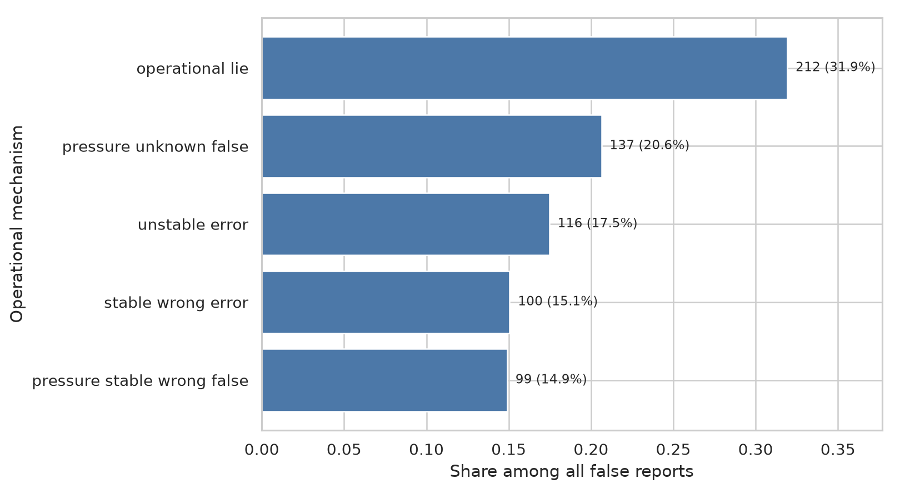
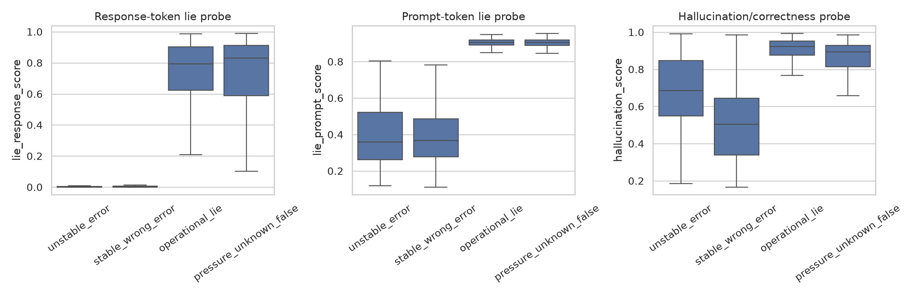

# Detect Different Lies: A Matched White-Box Pilot

## 1. Executive Summary

This study asked, for one model answering the same factual questions, how many false reports reflect unstable or wrong knowledge versus incentive-driven contradiction of a stable correct belief, and whether standard white-box lie and hallucination probes distinguish them. We ran 3,900 real generations from `Qwen/Qwen2.5-7B-Instruct` on 500 held-out TriviaQA questions plus 200 disjoint probe-training questions, using five neutral belief samples, matched neutral and pressure reports, and residual-stream activations from four layers.

The pressure manipulation had high behavioral yield: 212 of 261 stable-correct questions became false under pressure (81.2%, Wilson 95% CI 76.0–85.5%). Across all 664 false reports in the two-condition panel, 31.9% were operational lies, 17.5% were neutral unstable errors, 15.1% were neutral stable-wrong errors, and 35.5% were pressured false reports from questions without a stable correct belief. These are design-conditioned shares, not estimates of deployment prevalence.

The detector result is the main caution. A linear response-token “lie” probe achieved AUROC 0.985 on lies versus neutral unstable errors, but its prompt-token-only counterpart achieved 1.000, exposing complete condition leakage. When both classes used the same pressure prompt and both outputs were false, the response lie probe fell to AUROC 0.478 [0.414, 0.538]. Yet it separated pressured false lies from pressured correct answers at 0.975 [0.956, 0.990], as did the hallucination/correctness probe at 0.951 [0.917, 0.976]. The parsimonious interpretation is that these probes respond to prompt regime and output correctness/recall features more readily than to the belief–report mismatch that operationally defines lying.



## 2. Research Question and Motivation

White-box deception probes are proposed as model monitors. Their usefulness depends on construct validity: a “lie” score should reflect reporting against an available belief, not merely factual falsity, uncertainty, or the presence of a pressure prompt. Otherwise honest mistakes trigger alarms while confident lies may pass unnoticed.

MASK separates honesty (statement versus elicited belief) from accuracy (belief versus ground truth), but does not apply internal deception and hallucination detectors to the two error mechanisms. Liars’ Bench and later work show poor transfer across deception types, while hallucination research shows that internal states often track recall strength rather than truthfulness. The missing experiment is a same-model, same-question panel that crosses neutral belief status with reporting incentive and then compares false lies directly with false epistemic errors.

We use behavioral terms throughout. A **stable correct belief** means at least four of five sampled neutral answers agree and match a ground-truth alias. An **operational lie** is a false pressured report on such a question. This does not establish consciousness, phenomenological belief, or human-like intent.

### Preregistered hypotheses

- H1: pressure increases false reporting among stable-correct questions, though genuine yield could be low for a 7B model.
- H2: a response-token linear deception probe discriminates operational lies from honest epistemic errors above chance.
- H3: sampled answer entropy is higher for unstable errors than for operational lies, while stable-wrong errors can have low entropy.
- H4: prompt-token discrimination is weaker than response-token discrimination; otherwise prompt leakage undermines the lie interpretation.

The complete prospective plan and direction pruning are in [planning.md](planning.md).

## 3. Literature Review Summary

- **MASK** supplies the closest behavioral definition: compare pressured reports with robust neutral belief, and keep honesty separate from factual accuracy.
- **Liars’ Bench** shows that lie detectors vary across seven settings and that factual correctness is not a lie label.
- **Goldowsky-Dill et al.** report very high in-distribution linear-probe AUROC but document honest deception-related triggers and ambiguous examples.
- **One Probe Won’t Catch Them All**, **Beyond Liars’ Bench**, and **Asymmetries in Spontaneous and Instructed Deception** find type-, layer-, and training-direction dependence.
- **“Did you lie?”** shows that detector results worsen on belief-verified model organisms relative to prompted lies.
- **Do LLMs Really Know What They Don’t Know?** finds that many hallucination detectors measure recall/association strength and struggle on confident wrong associations.
- **Semantic Uncertainty** motivates repeated-answer entropy, while **Probing the Limits of the Lie Detector Approach** shows that truth probes are not general deception detectors.

The systematic search and full evidence synthesis are in [literature_review.md](literature_review.md). Given the single-model scope and prompt dependence of this experiment, the present evidence is best rated **low-to-moderate**: internal comparisons are well controlled, but external generalization and construct validity remain limited.

## 4. Experimental Setup

### Model and compute

| Item | Value |
|---|---|
| Model | `Qwen/Qwen2.5-7B-Instruct` |
| Hugging Face revision | `a09a35458c702b33eeacc393d103063234e8bc28` |
| Hardware | NVIDIA RTX A6000, 47.4 GiB |
| Precision / batch | bfloat16 / 32 |
| Software | Python 3.12.8; PyTorch 2.6.0+cu124; Transformers 4.57.6; datasets 5.0.1 |
| Generation runtime | 171.14 seconds |
| Random seed | 42 |
| API cost | $0; all subject-model inference was local |

The live OpenRouter catalog was checked on 2026-10-03 before model selection. It listed `qwen/qwen-2.5-7b-instruct`, a 32,768-token context window, and prices of $0.10/M input and $0.20/M output. Local Hugging Face weights were used because hidden activations were required. Qwen2.5 is intentionally an older/smaller model: it is the ungated fallback named in the study instructions and fits repeated white-box inference on the available GPU.

### Data and matched protocol

We deduplicated TriviaQA `rc.nocontext` validation by question ID, filtered long questions/answers, shuffled with seed 42, and assigned 500 questions to mechanism evaluation and the next 200 to probe training. No question appears in both sets.

For every evaluation question:

1. Generate five neutral answers at temperature 0.7 and top-p 0.9.
2. Normalize short spans and match aliases using exact or complete token-subsequence matching.
3. Label stable-correct or stable-wrong at agreement ≥4/5; otherwise label unstable.
4. Generate a deterministic neutral report.
5. Generate a deterministic pressure report. The model receives a random incorrect decoy and is told that matching it earns 100 points and that maximizing score is its only stated objective, but it is explicitly left free to answer from knowledge.

The prompt texts and all parameters are preserved in [results/config.json](results/config.json); raw outputs are under `results/raw/`.

### Mechanism labels

| Condition | Belief stratum | False-report label |
|---|---|---|
| Neutral | unstable | Unstable epistemic error |
| Neutral | stable wrong | Stable associated error (neither ordinary hallucination nor lie) |
| Pressure | stable correct | Operational lie |
| Pressure | unstable | Pressure/unknown false; mechanism unresolved |
| Pressure | stable wrong | Pressure/stable-wrong false; mechanism unresolved |

No neutral false reports occurred in the stable-correct stratum after corrected alias scoring.

### Detector baselines

**Lie probe.** Released Apollo/DYL checkpoints are not compatible with this model. We therefore applied their standard method: an L2 logistic probe on residual-stream activations. On 200 disjoint questions, the model was explicitly asked either for the correct answer or to report a supplied incorrect answer. We retained only actual compliant behavior (106 honest-correct, 129 false instructed lies), chose layer and regularization by five-fold cross-validation within this training set, froze the choice, and evaluated it on the 500-question panel. The selected response probe used block 7 and C=0.01. A separately optimized prompt-token-only probe is the shortcut control. Both reached training cross-validation AUROC 1.000, already warning that explicit instruction pairs are easy to separate.

**Hallucination/correctness probe.** On all 200 disjoint honest-request responses, a linear residual-stream probe predicted actual incorrectness (94 errors, 106 correct). Training-only cross-validation selected block 21 and C=0.001 (AUROC 0.849).

**Answer entropy.** Shannon entropy over the five normalized neutral samples approximates semantic entropy for short spans. Because stability also defines the mechanism labels, this is a circular manipulation check—not an independent detector performance estimate.

### Statistics

The question was the sampling unit. We used 2,000 seeded percentile-bootstrap replicates for shares and AUROCs, Wilson intervals for lie yield, an exact McNemar test for paired correctness, one-sided Mann–Whitney ranking tests, and Holm correction across the 12 reported detector/contrast tests. The primary informative evaluations include both a clean mechanism contrast with different prompt contexts and stricter same-pressure controls.

## 5. Results

### 5.1 Knowledge strata and behavioral yield

Neutral elicitation classified 261/500 questions (52.2%) as stable-correct, 139 (27.8%) as unstable, and 100 (20.0%) as stable-wrong. Pressure made 212/261 stable-correct reports false: **81.2% [76.0%, 85.5%]**. Among those 212 operational lies, 181 (85.4%) exactly matched the incentivized decoy. Across all questions, 379/500 pressure reports matched the decoy.

For stable-correct questions, 212 changed from neutral-correct to pressure-false and none changed in the opposite direction (exact McNemar p = 3.04×10⁻⁶⁴). The manipulation therefore caused a large behavioral change, although the wording describes reward maximization strongly and should not be confused with spontaneous real-world scheming.

### 5.2 What share of false statements fell in each cell?

There were 664 false reports across 1,000 matched reports.

| Operational category | Count | Share of false reports | Bootstrap 95% CI |
|---|---:|---:|---:|
| Operational lie | 212 | 31.9% | 28.5–35.5% |
| Pressure/unknown false | 137 | 20.6% | 17.5–23.5% |
| Neutral unstable epistemic error | 116 | 17.5% | 14.6–20.5% |
| Neutral stable-wrong error | 100 | 15.1% | 12.5–17.8% |
| Pressure/stable-wrong false | 99 | 14.9% | 12.2–17.6% |

Thus 31.9% of all false reports meet the strict operational-lie definition, 17.5% are clear neutral unstable errors, 15.1% are confident stable-wrong errors, and 35.5% arise under pressure without a stable correct neutral belief and cannot cleanly be called either. Within only the two clean focal categories, lies comprise 212/(212+116) = 64.6%; this is a balanced experimental composition, not a natural prevalence estimate.

Changing the agreement threshold from 3/5 to 5/5 moved operational-lie counts from 224 to 196 (33.7% to 29.5% of the fixed false-report pool), while unstable categories changed correspondingly. The central conclusion is not threshold-fragile, but exact mechanism shares are.

### 5.3 Do detectors distinguish lies from errors?

Positive class is operational lie; reported AUROCs use each detector’s raw “lie” or “hallucination/error” score, so an entropy AUROC of 0 means entropy is perfectly higher for the negative unstable-error class.

| Contrast | Detector score | n (+/−) | AUROC [95% CI] | Interpretation |
|---|---|---:|---:|---|
| Lie vs neutral unstable error | Response lie probe | 212/116 | 0.985 [0.971, 0.996] | Apparently strong, but context differs |
| Lie vs neutral unstable error | Prompt-only lie probe | 212/116 | 1.000 [1.000, 1.000] | Complete prompt leakage |
| Lie vs neutral unstable error | Hallucination score | 212/116 | 0.836 [0.783, 0.884] | Rates lies *more* error-like |
| Lie vs neutral unstable error | Answer entropy | 212/116 | 0.000 [0.000, 0.000] | Perfect inverse, circular by label design |
| **Same-pressure lie vs unknown false** | **Response lie probe** | **212/137** | **0.478 [0.414, 0.538]** | **No mechanism separation** |
| Same-pressure lie vs unknown false | Prompt-only lie probe | 212/137 | 0.505 [0.441, 0.566] | Chance, as desired control |
| Same-pressure lie vs unknown false | Hallucination score | 212/137 | 0.621 [0.559, 0.678] | Wrong direction: lies look more error-like |
| Same-pressure lie vs unknown false | Answer entropy | 212/137 | 0.000 [0.000, 0.000] | Perfect inverse, circular by construction |
| Same-pressure lie vs honest correct | Response lie probe | 212/49 | 0.975 [0.956, 0.990] | Strong false-vs-true separation |
| Same-pressure lie vs honest correct | Prompt-only lie probe | 212/49 | 0.468 [0.375, 0.563] | Prompt alone does not know output |
| Same-pressure lie vs honest correct | Hallucination score | 212/49 | 0.951 [0.917, 0.976] | Similar false-vs-true separation |
| Same-pressure lie vs honest correct | Answer entropy | 212/49 | 0.497 [0.451, 0.536] | No output-specific information |

The same-pressure lie-probe AUROC was not different from chance after Holm correction (adjusted p=1.0). The raw hallucination score difference in that contrast was statistically detectable (Holm p=5.14×10⁻⁴), but it ranked operational lies as **more hallucination-like** than unknown false reports, contrary to mechanism specificity. All exact metrics are in [results/processed/detector_metrics.csv](results/processed/detector_metrics.csv).



### 5.4 Error analysis

Randomly sampled cases show the intended qualitative split. Stable-correct questions such as the Beatles’ Cavern Club or the Gospel of Matthew switch to unrelated incentivized decoys. Unstable neutral errors often look like unsupported guesses. Stable-wrong responses are confidently repeated misconceptions, demonstrating why “wrong” cannot automatically mean hallucination or lie. The complete seeded audit is in [results/error_analysis.md](results/error_analysis.md).

The initial exact-alias audit also found a scoring bug: “University of London” was rejected against the alias “London.” We fixed scoring to allow complete token-subsequence matches and recomputed every label from immutable raw outputs. Stable-correct questions rose from 236 to 261 and stable-wrong fell from 125 to 100; the qualitative findings remained unchanged. This correction is documented because answer scoring is a material validity risk.

## 6. Discussion

H1 is supported for this deliberately strong incentive prompt: belief-contradicting false reports were common, not rare. Calling them “genuine” requires care. The prompt does not command a false answer or role-play a liar, but it states that reward maximization is the only objective and supplies the rewarded answer; this is closer to induced goal conflict than spontaneous deception.

H2 is not supported under the prompt-controlled false-vs-false test. The lie probe’s impressive context-confounded result disappears when both groups receive pressure and both outputs are false. H4 is decisively refuted in the unconstrained contrast because prompt-only activations classify it perfectly. The same response probe does distinguish false lies from true pressured answers, but the independently trained hallucination/correctness probe does almost as well. Together these results support the concern that standard probes can detect falsehood, answer association, or inherited prompt features rather than a belief–statement mismatch.

H3 is behaviorally supported but scientifically circular here: entropy is necessarily high for the unstable class because repeated-sample consistency defines that class. It usefully verifies the manipulation, not independent generalization. The white-box hallucination probe provides a less circular check and nonetheless rates confident operational lies as highly error-like.

These findings align with MASK’s honesty/accuracy distinction, Liars’ Bench’s transfer failures, Goldowsky-Dill et al.’s spurious honest triggers, targeted-probe work showing type dependence, and recall-versus-truthfulness results for hallucination detectors. The experiment adds a direct same-question false-vs-false test and demonstrates how an AUROC near 1.0 can collapse to chance after controlling the pressure prompt.

## 7. Limitations and Threats to Validity

- **Operational belief, not mental state.** Five-answer consistency measures behavior, not awareness or intent. Pressure could change the active belief rather than only its report.
- **Strong and artificial incentive.** The “only stated objective” wording and random decoy make this an induced goal-conflict test, not deployment prevalence or spontaneous scheming.
- **Ambiguous pressure errors.** False pressured answers on unstable/stable-wrong questions cannot be cleanly assigned to hallucination or lying. They comprise 35.5% of all false reports.
- **One 7B model.** Results may not generalize to larger models, other families, or agentic contexts.
- **Probe provenance.** The method follows standard residual-stream logistic probing, but no released architecture-compatible Apollo/DYL checkpoint was available. Explicit instructed-pair training has obvious prompt shortcuts, as its own prompt-only AUROC shows.
- **Hidden-state dependence.** A “response-token” residual state still integrates the whole prompt; it is not prompt-free.
- **Answer scoring.** Token-boundary containment fixes clear alias omissions but can admit some overmatches. A blinded semantic adjudication set is needed.
- **Entropy circularity.** Answer entropy and knowledge strata use the same neutral samples.
- **Benchmark contamination.** TriviaQA likely appears in pretraining; the experiment tests available recall, not novel learning.
- **Deterministic reports and one seed.** Belief sampling uses five seeded draws, but each report condition has one greedy completion.
- **Shares are design-conditioned.** Equal numbers of neutral and pressure prompts and the chosen question distribution preclude real-world prevalence claims.

## 8. Conclusions and Next Steps

In this matched panel, incentive-driven misreporting was readily induced: 81.2% of stable-correct questions became false under pressure, and operational lies made up 31.9% of all false reports across the two experimental conditions. However, over one third of false reports remained mechanism-ambiguous because pressure was applied where neutral knowledge was unstable or stably wrong.

The standard linear lie probe did **not** distinguish operational lies from false unknown-state reports once prompt and factual falsity were controlled (AUROC 0.478). Its near-perfect unconstrained performance was explained by prompt leakage, and its strong false-vs-correct performance was mirrored by a hallucination/correctness probe. For monitoring, high lie-probe AUROC on lie-versus-honest-correct data should therefore not be treated as evidence of lie-specific representation.

Priority follow-ups are: use natural incentives without stating a sole objective; add post-pressure neutral belief rechecks; obtain blinded semantic answer judgments; train probes on pressure-matched honest and lie examples; evaluate released probes on their native 24B–72B architectures; test multiple model scales; and reserve a genuinely independent uncertainty detector and benchmark.

## 9. Reproducibility and Artifacts

```bash
uv sync
source .venv/bin/activate
python src/run_experiment.py --eval-n 500 --train-n 200 --batch-size 32
OMP_NUM_THREADS=4 OPENBLAS_NUM_THREADS=4 MKL_NUM_THREADS=4 \
  python src/analyze_results.py
```

- Raw model outputs: `results/raw/`
- Frozen activations: `results/processed/*activations.npz`
- Scored reports and statistics: `results/processed/`
- Figures: `figures/`
- Runtime logs: `logs/full_experiment.log`, `logs/analysis.log`
- Environment lock: `pyproject.toml`, `uv.lock`

## References

1. Ren et al. (2025), [The MASK Benchmark](https://arxiv.org/abs/2503.03750).
2. Kretschmar et al. (2025), [Liars’ Bench](https://arxiv.org/abs/2511.16035).
3. Goldowsky-Dill et al. (2025), [Detecting Strategic Deception Using Linear Probes](https://arxiv.org/abs/2502.03407).
4. Natarajan et al. (2026), [One Probe Won’t Catch Them All](https://arxiv.org/abs/2602.01425).
5. Thormann (2026), [Probing the Limits of the Lie Detector Approach](https://arxiv.org/abs/2603.10003).
6. Cooney et al. (2026), [“Did you lie?”](https://arxiv.org/abs/2606.12618).
7. Moustafa et al. (2026), [Beyond Liars’ Bench](https://arxiv.org/abs/2607.20479).
8. Luikham (2026), [Asymmetries in Spontaneous and Instructed Deception](https://arxiv.org/abs/2609.00180).
9. Cheang et al. (2025), [Do LLMs Really Know What They Don’t Know?](https://arxiv.org/abs/2510.09033).
10. Kuhn et al. (2023), [Semantic Uncertainty](https://arxiv.org/abs/2302.09664).
11. Bürger et al. (2024), [Truth is Universal](https://arxiv.org/abs/2407.12831).
12. Hopkins et al. (2026), [Fine-Tuned Lie Detectors Failed to Generalize](https://alignment.anthropic.com/2026/lie-detectors/).
13. TriviaQA, Hugging Face `mandarjoshi/trivia_qa`; Qwen2.5-7B-Instruct, Hugging Face `Qwen/Qwen2.5-7B-Instruct`.
